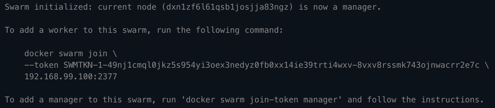
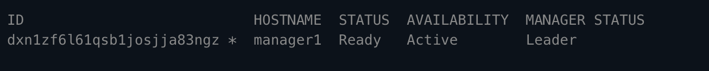
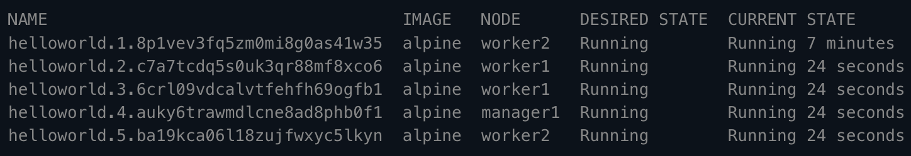

# Docker Swarm Tutorial 


## Introduction 

This tutorial is about docker swarm as the name suggests. The scope of this tutorial is talk about the motivation behind docker swarm, how it works in brief and provide a quick guide to jump start on your local machine to see how it works.

### Notes 

{} - indicates a placeholder variable for a command

## About Container Orchestration 

In a world of containers, managing them can often prove to be difficult in the context of scalability, distributed environments and having a lot of infrastructure. Docker swarm allows just for that. It allows for containers to run across several computing devices often virtual machines in the cloud. It is similar to kubernetes in the sense of its goal to orchestrate and manage containers. It often is far easier to setup and get started than kubernetes. Docker swarm has many goals, some of them include:

- An easy way to scale applications across computing resources 
- Offerring fault tolerance & reliablity 
- Load Balancing requests 
- Rolling Updates that allows the service to be up despite updates through replicas 
- Easy to Learn 
- Built natively into docker engine


The larger goal of swarm and container orchestration is to make it easy for scalable applications to be built by using smarter technologies that manage and reduce overhead as developers to manage application infrastructure while mainting scalability and high throughput. 

This tutorial does not expect you to have access to multiple computing resources hence it demonstrates use of swarm with one manager node that also acts as worker node in hope to show the concepts behind swarm. 


## Prerequisites & Getting Started

For this tutorial to work, you will need to have docker version 19.0 or above installed through docker for linux or desktop for mac or docker desktop for windows. Downloads to these can be found [here](https://docs.docker.com/get-docker/).

In terms of knowledge, this tutorial assumes basic knowledge of docker, containers and docker-compose. 

## Basic Concepts 

This section contains some of the key concepts part of docker swarm. 

### A Node

A node is used to indicate a physical computing resource in the context of docker swarm. A node often defines a single virtual machine running docker engine. 

### Manager Nodes

Manager nodes distribute and schedule incoming tasks onto the Worker nodes, maintain the cluster state and perform orchestration and cluster management functions. Manager Nodes can also optionally run services for Worker nodes.

Cluster management tasks include:
- Maintaining the cluster state
- Scheduling services
- Serving swarm mode to HTTP API endpoints

There should always be multiple manager nodes in your swarm because of the following reasons:

- Maintaining high availability
- Easily recover from a manager node failure without downtime

That is why Docker recommends you implement an odd number of nodes according to your projects availability requirements.

### Worker Nodes 

Worker nodes are also instances of the Docker Engine whose sole purpose is to execute containers and services as instructed by the Manager Nodes.

### A service

A service is the definition of the tasks to execute on the nodes. It is the primary root of user interaction with the swarm.

When you create a service, you specify which container image to use and which commands to execute inside running containers. You also define other options for the service including:
- the port you want to expose
- CPU and memory limitations
- the number of replicas of the image to run in the swarm
- a rolling update policy

These parameters can also be defined through a docker-compose yaml file and deployed into the swarm. 

The following is an image of a service which is nginx (a web server) having 3 replicas being deployed on 3 nodes. 


## Tutorial - Running Swarm Locally

### Initializing docker swarm 

```
docker swarm init
```

Sample Output:


This command initializes the swarm environment and makes the current device as a manager node. 

### View information about the nodes in the swarm 

```
docker node ls
```

Sample Output:


### Create a service 

```
docker service create --replicas {number of replicas} --name {service name} {image name}
```

Example: 

```
docker service create --replicas 1 --name helloworld nginx
```

We can also use a docker-compose file to define this: 

Sample Yaml:
```
version: "3"
services:
  dataservice:
    image: nginx:latest
    deploy:
      replicas: 3
    ports:
      - "3000:80"
```

The above yaml file defines a service: dataservice with 3 replicas and uses the latest nginx image while exposing the port 80 container to port 3000 of the host. 

To run such an example application you can clone this repo, make a swarm from the prevous commands and create a service through the following commands:

```
git clone https://github.com/abhinavtripathy/docker-swarm.git
docker stack deploy -c sample.yml app
```

Go to [localhost:3000](localhost:3000) to view the welcome page for nginx after running those commands. 

In general the format to create a service in swarm from a docker-compose yaml file is:

```
docker stack deploy -c {docker-compose file name} {docker compose app name}
```

Docker stack is a command used to deploy a docker-compose file in a swarm environment. 

### Check running services

```
docker service ls 
```

Sample Output:


### Scaling service

```
docker service scale {service name}={number of replicas}
```

Sample Output:


### Viewing state of worker nodes 

```
docker service ps {service name}
```

Sample Output:


### Remove a service 

```
docker service rm {service name}
```

### Quit Swarm Mode 

```
docker swarm leave
```

If the above doesn't work due to the current machining being a manager node. Use the following commmand:

```
docker swarm leave --force
```

## Docker Swarm Commands Cheatsheet 

```
#Initilizes swarm environment 
docker swarm init 

#Check the current state of the swarm with container information
docker info 

#View information of nodes in the swarm 
docker node ls 

#Create a service with the CLI
docker service create --replicas {number of replicas} --name {service name} {image name} 

#Create a service with docker-compose file
docker stack deploy -c {docker-compose file name} {docker compose app name} 

#Scaling a service
docker service scale {service name}={number of replicas}

#Check for running services 
docker service ls

#View state of worker nodes
docker service ps {service name}

#Remove a service
docker service rm {service name}

#Leave Swarm 
docker swarm leave 

#Leave swarm forcefully 
docker swarm leave --force
```

## Acknowledgements 

- [Docker Swarm Guide](https://gabrieltanner.org/blog/docker-swarm)
- [Official Docker Swarm Tutorial](https://docs.docker.com/engine/swarm/swarm-tutorial/)

